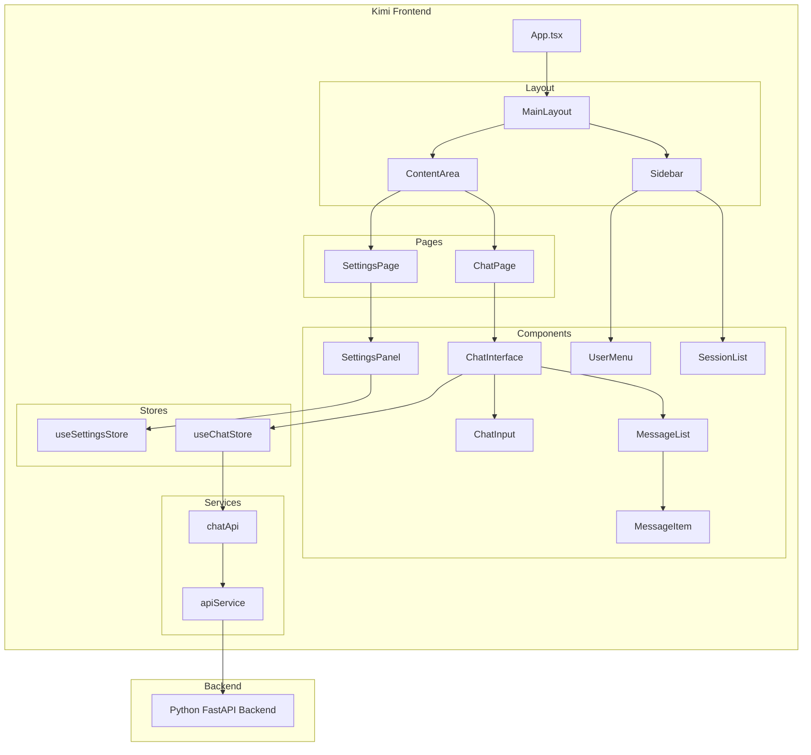

# Design Document: Kimi Style Frontend

## Overview

本设计文档描述了一个采用 Kimi AI 风格的新前端应用程序。该应用将使用 React + JSX + Tailwind CSS 构建，提供现代化的 AI 对话界面和系统设置功能。设计重点是简洁、现代的用户体验，采用深色侧边栏 + 浅色内容区的经典布局。

### 技术栈选择

- **框架**: React 18 + JSX (JavaScript)
- **构建工具**: Vite
- **样式**: Tailwind CSS 4.x
- **状态管理**: Zustand
- **路由**: React Router v6
- **HTTP 客户端**: Axios
- **图标**: Lucide React (轻量级图标库)
- **Markdown 渲染**: react-markdown

## Architecture



## Components and Interfaces

### 1. Layout Components

#### MainLayout
主布局组件，负责整体页面结构。

```javascript
// Props: { children }
// - children: React 子组件
```

#### Sidebar
左侧边栏组件，包含导航和用户信息。

```javascript
// Props: { collapsed, onCollapse }
// - collapsed: boolean - 是否折叠
// - onCollapse: function(collapsed) - 折叠状态变化回调
```

### 2. Chat Components

#### ChatInterface
聊天界面主组件。

```javascript
// Props: { sessionId }
// - sessionId: string - 当前会话 ID (可选)
```

#### MessageList
消息列表组件。

```javascript
// Props: { messages, onSuggestionClick }
// - messages: array - 消息数组
// - onSuggestionClick: function(suggestion) - 建议点击回调
```

#### MessageItem
单条消息组件。

```javascript
// Props: { message, onSuggestionClick }
// - message: object - 消息对象
// - onSuggestionClick: function(suggestion) - 建议点击回调
```

#### ChatInput
聊天输入组件。

```javascript
// Props: { onSend, disabled, placeholder }
// - onSend: function(content, images) - 发送消息回调
// - disabled: boolean - 是否禁用
// - placeholder: string - 占位文本
```

#### SessionList
会话列表组件。

```javascript
// Props: { sessions, currentSessionId, onSelect, onDelete }
// - sessions: array - 会话数组
// - currentSessionId: string - 当前会话 ID
// - onSelect: function(sessionId) - 选择会话回调
// - onDelete: function(sessionId) - 删除会话回调
```

### 3. Settings Components

#### UserMenu
用户菜单组件。

```javascript
// Props: { user, onSettingsClick, onLogout }
// - user: object - 用户信息
// - onSettingsClick: function - 点击设置回调
// - onLogout: function - 登出回调
```

#### SettingsPanel
设置面板组件。

```javascript
// Props: { onClose }
// - onClose: function - 关闭回调
```

## Data Models

### Message
```javascript
// 消息对象结构
{
  id: 'string',           // 消息唯一 ID
  role: 'user|assistant|system',  // 消息角色
  content: 'string',      // 消息内容
  timestamp: 'string',    // 时间戳 (ISO 格式)
  images: ['string'],     // 图片数组 (Base64, 可选)
  suggestions: ['string'], // 建议问题数组 (可选)
  sources: [Source],      // 来源数组 (可选)
  error: false            // 是否错误消息 (可选)
}
```

### Session
```javascript
// 会话对象结构
{
  id: 'string',           // 会话唯一 ID
  title: 'string',        // 会话标题
  messages: [Message],    // 消息数组
  createdAt: 'string',    // 创建时间
  updatedAt: 'string',    // 更新时间
  tenantId: 'string'      // 租户 ID (可选)
}
```

### User
```javascript
// 用户对象结构
{
  id: 'string',           // 用户 ID
  name: 'string',         // 用户名
  phone: 'string',        // 手机号 (可选)
  avatar: 'string'        // 头像 URL (可选)
}
```

### Settings
```javascript
// 设置对象结构
{
  theme: 'light|dark|system',  // 主题模式
  language: 'zh|en',           // 语言
  autoExpandReferences: true   // 自动展开参考网页
}
```

### Source
```javascript
// 来源对象结构
{
  title: 'string',        // 来源标题
  url: 'string',          // 来源 URL (可选)
  content: 'string'       // 来源内容 (可选)
}
```


## Correctness Properties

*A property is a characteristic or behavior that should hold true across all valid executions of a system-essentially, a formal statement about what the system should do. 
Properties serve as the bridge between human-readable specifications and machine-verifiable correctness guarantees.*

Based on the prework analysis, the following correctness properties have been identified:

### Property 1: Message Sending Integrity
*For any* valid non-empty message content, when a user sends a message, the message SHALL be added to the current session's message list with role 'user' AND the chat API SHALL be called with the correct request format containing the message content and thread ID.

**Validates: Requirements 2.2, 6.1**

### Property 2: AI Response Rendering
*For any* valid API response containing an answer, the Chat_Interface SHALL parse the response and display it as a message with role 'assistant', including any sources or suggestions if present in the response.

**Validates: Requirements 2.3, 6.2**

### Property 3: Message Role Styling
*For any* message in the message list, the rendered message SHALL have distinct visual styling based on its role (user messages right-aligned with primary color, assistant messages left-aligned with neutral background).

**Validates: Requirements 2.4**

### Property 4: Session Switching Consistency
*For any* session selected from the session list, the messages displayed in the Chat_Interface SHALL exactly match the messages stored in that session object.

**Validates: Requirements 2.6**

### Property 5: Settings Persistence Round-Trip
*For any* setting value changed by the user, saving the setting and then reading it back from local storage SHALL return the same value that was saved.

**Validates: Requirements 3.5, 6.4**

## Error Handling

### API Errors
- 网络错误：显示 "网络连接失败，请检查网络后重试" 提示
- 服务器错误 (5xx)：显示 "服务暂时不可用，请稍后重试" 提示
- 认证错误 (401)：跳转到登录页面
- 请求错误 (4xx)：显示具体错误信息

### State Errors
- 会话初始化失败：自动创建新会话
- 消息发送失败：在消息列表中显示错误状态，允许重试
- 设置保存失败：显示错误提示，保持原有设置

### UI Errors
- 组件渲染错误：使用 Error Boundary 捕获，显示友好错误页面
- 图片加载失败：显示占位图
- 音频录制失败：提示用户检查麦克风权限

## Testing Strategy

### Unit Testing
使用 Vitest 进行单元测试，覆盖以下场景：

1. **Store 测试**
   - useChatStore: 测试 addMessage, createSession, deleteSession 等方法
   - useSettingsStore: 测试设置的读取和保存

2. **工具函数测试**
   - API 请求格式化
   - 时间格式化
   - 手机号脱敏

3. **组件渲染测试**
   - 各组件在不同 props 下的渲染结果

### Property-Based Testing
使用 fast-check 库进行属性测试，验证正确性属性：

1. **Property 1 测试**: 生成随机有效消息，验证发送后消息列表正确更新
2. **Property 2 测试**: 生成随机 API 响应，验证解析和显示正确
3. **Property 3 测试**: 生成随机消息列表，验证每条消息样式正确
4. **Property 4 测试**: 生成随机会话数据，验证切换后显示正确
5. **Property 5 测试**: 生成随机设置值，验证保存和读取一致

每个属性测试配置运行 100 次迭代。

测试文件命名规范：`*.test.js` 或 `*.spec.js`

### Integration Testing
- 测试完整的用户交互流程
- 测试 API 集成（使用 MSW mock）

## File Structure

```
kimi-frontend/
├── index.html
├── package.json
├── vite.config.js
├── tailwind.config.js
├── postcss.config.js
├── public/
│   └── logo.svg
├── src/
│   ├── main.jsx
│   ├── App.jsx
│   ├── App.css
│   ├── index.css
│   ├── components/
│   │   ├── layout/
│   │   │   ├── MainLayout.jsx
│   │   │   └── Sidebar.jsx
│   │   ├── chat/
│   │   │   ├── ChatInterface.jsx
│   │   │   ├── ChatInput.jsx
│   │   │   ├── MessageList.jsx
│   │   │   ├── MessageItem.jsx
│   │   │   ├── SessionList.jsx
│   │   │   └── WelcomeScreen.jsx
│   │   ├── settings/
│   │   │   ├── SettingsPanel.jsx
│   │   │   └── UserMenu.jsx
│   │   └── common/
│   │       ├── AudioRecorder.jsx
│   │       └── ImageUploader.jsx
│   ├── pages/
│   │   ├── ChatPage.jsx
│   │   └── SettingsPage.jsx
│   ├── stores/
│   │   ├── index.js
│   │   ├── useChatStore.js
│   │   └── useSettingsStore.js
│   ├── services/
│   │   ├── api.js
│   │   └── chatApi.js
│   └── utils/
│       └── helpers.js
└── tests/
    ├── stores/
    │   └── chatStore.test.js
    └── properties/
        └── chat.property.test.js
```
